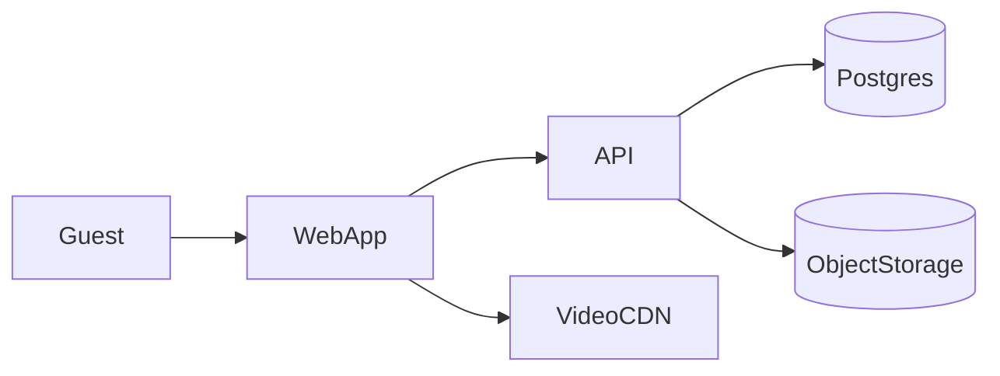

**Project-visible copy:** This file is the durable plan in the repo (`docs/plans/`). A copy may also exist at `.cursor/plans/hotel_marketplace_video_tours_8639ddc4.plan.md` for Cursor; when updating the plan, edit this file (or keep both in sync).

**Revision log:** `2026-04-23` — Frontend section updated: Tailwind excluded; Mantine / MUI / Ant Design / Radix + Vanilla Extract (or CSS Modules) / Emotion-style options documented; todo `pick-styling-stack` added. **Frontend sub-plan:** [frontend_hotel_marketplace.md](frontend_hotel_marketplace.md).

# Hotel marketplace with interactive video tours (v1: discovery + tours)

## Problem frame and scope

You are building a **B2B2C discovery marketplace**: hotels publish listings and rich room/tour content; guests browse, experience **guided, step-based video tours** (lobby, corridors, room types), with **information overlays** and optional **voice** for an “intelligent guide” feel. **v1 explicitly excludes online payment**, which removes PCI scope for now but still requires **leads/inquiries**, moderation, and clear terms.

Non-goals for v1 (unless scope expands): payment capture, chargebacks, complex revenue management, native mobile apps (ship responsive web first).

## Experience model (cinematic + guide layers)

Split the experience into two layers so engineering stays tractable and production stays reliable:

1. **Cinematic layer (video)**: high-quality HLS (or DASH) via a video CDN. Prefer **pre-produced segments** (or one master file with explicit **chapter/cue metadata**), not generative video.
2. **Guide layer (UI + optional audio)**: timed **callouts**, **step titles**, **facts**, **CTAs** (“Continue”, “Show amenities”, “Next: bathroom”), and optional **TTS or pre-recorded narration** per step.

**User-led progression** is a **state machine**: each step defines media (file or time range), UI payload (text, images, links), optional audio, and **advance rules** (e.g. requires explicit user tap). This yields a conversational rhythm without unreliable real-time branching video.

**Later (optional):** conversational AI (RAG over hotel FAQs/policies) in a **side panel** — must not block core tour playback.

## Plan review — gaps closed by this revision

The following items were identified in a plan analysis and are now **first-class requirements or decisions** in this document:

| Area | Enhancement |
| --- | --- |
| Search/filters | Explicit **MVP search contract** and schema guidance (below). |
| Availability | Explicit **v1 policy options**; must align UI copy and schema. |
| Video ops | **Media pipeline states** and failed transcode handling. |
| Accessibility | **Captions**, keyboard control, focus order, reduced motion for the tour player. |
| Legal/ops | **Terms and GDPR posture** as a parallel workstream (no payments does not remove privacy obligations). |
| CMS sequencing | **Freeze `TourStep` manifest** before heavy CMS work; add **versioning/publish snapshots**. |
| Runtime edge cases | **Long-session signed URL refresh**; **concurrent tour edits** strategy. |

## Search and filters (MVP contract)

Decide and document v1 behavior before indexing/schema hardens:

- **Must-have facets** (suggested baseline): city/region, price band (self-reported by hotel), star category or “property type,” core amenities (wifi, parking, pets, breakfast), accessibility flags if collected truthfully.
- **Implementation**: start with **Postgres** (trigram / FTS + structured filters). Plan migration to **Meilisearch** or **Typesense** only if relevance or latency becomes a problem.
- **Schema hint**: prefer **normalized amenity tags** (join table or enum-backed rows) over opaque JSON blobs for filter correctness; use JSON only for extensibility behind a controlled vocabulary.

## Availability and inventory (v1 policy)

Pick one policy and state it everywhere (listing cards, detail pages, inquiry disclaimers):

1. **Informational only** — “typical rates” / “usually available” with no calendar (lowest engineering; clearest legal copy).
2. **Manual blackout text** — hotel-maintained season notes (still no real availability engine).
3. **Hidden availability** — browse and inquire only; no dates until hotel responds.

Defer **iCal / channel manager sync** to a later phase unless you have a hard requirement in v1.

## Tour manifest schema (freeze early)

Before building the full hotel tour editor, **version and document** a JSON manifest (or DB rows mirroring it) for `TourStep`:

- **Identity**: `stepId`, `order`, `kind` (lobby, corridor, room, amenity_spot).
- **Media**: provider asset id or URL reference, `clipMode` (separate file vs window in master), `startSec` / `endSec` when using a master.
- **UI**: title, body, optional image refs, CTA labels, `requiresUserContinue`.
- **Accessibility**: **WebVTT path or caption segments** per step (or per clip); language code.
- **Audio**: optional `narrationUrl` or `ttsVoiceId` + script text for batch generation.
- **Analytics**: optional stable `stepKey` for funnels.

**Publishing model**: store **immutable published snapshots** (or version rows) so in-flight guest sessions are not broken when a hotel edits a draft.

## Video authoring and media pipeline

**Authoring modes** (unchanged tradeoff, now operationalized):

- **Preferred**: multiple short clips per tour — simplest mental model for hotels and simplest “continue” UX.
- **Acceptable**: one master + **cue points** — fewer uploads, more editor and QA complexity.

**Pipeline states** (hotel-visible status + admin tools):

`uploaded` → `processing` (transcode) → `ready` | `failed` → (optional) `in_review` → `published`

Define and enforce **technical specs** upfront: max duration per clip, resolution/aspect ratio, max file size, **audio loudness** guidance, banned formats. On **failure**, show actionable errors (“unsupported codec,” “file too large”) and retain the previous published version.

**Concurrency**: if two staff edit the same tour, use **optimistic locking** (version column) or warn “another editor has unsaved changes” — avoid silent overwrites.

## Accessibility and internationalization

- **Captions**: treat **subtitles/captions** as first-class per step or per clip (WCAG 2.2 AA target for the player chrome and timed text where applicable).
- **Keyboard**: play/pause, next step (when allowed), focus traps only where intentional (modals), visible focus rings.
- **Motion**: respect `prefers-reduced-motion` (reduce parallax/animations; optional simpler transitions).
- **i18n**: even English-only v1 benefits from a **copy layer** for future locales; date/number formatting hooks in the app help later EU expansion.

## Recommended technology choices

### Frontend (Tailwind intentionally excluded)

**Next.js (App Router) + TypeScript** stays the default app shell (SEO, server components for listing pages).

**Styling constraint:** **shadcn/ui** is Tailwind-first; without Tailwind, prefer a **library with its own styling model** or **headless primitives + explicit CSS**.

**Better options (pick one primary direction):**

1. **Full component system (fastest path to polished marketplace + dashboard)**  
   - **[Mantine](https://mantine.dev/)** — Large React component set, theming API, CSS modules–style output, strong forms/tables/date pickers for the hotel admin side. Good default when you want speed without utility CSS.  
   - **[MUI](https://mui.com/)** (Material or Joy) — Very mature, global theme tokens, huge ecosystem. Heavier runtime/bundle than Mantine in many setups; extremely hireable.  
   - **[Ant Design](https://ant.design/)** — Excellent if the admin experience dominates and an “enterprise admin” look is acceptable; guest-facing marketing pages need more custom theming to feel boutique.

2. **Headless + authored CSS (strongest brand differentiation, more build cost)**  
   - **[Radix UI](https://www.radix-ui.com/)** or **[React Aria Components](https://react-spectrum.adobe.com/react-aria/)** for accessible primitives (dialog, select, tabs, slider for video chrome).  
   - Pair with **CSS Modules + PostCSS** (nesting, `oklch` tokens) or **[Vanilla Extract](https://vanilla-extract.style/)** for **type-safe design tokens** and **zero-runtime** stylesheets — best when you want a distinctive hospitality brand and are willing to design layout primitives yourself.

3. **Scoped CSS-in-JS (middle ground)**  
   - **Emotion** or **styled-components** for component-scoped styles with familiar React patterns; combine with a small internal component kit. Runtime cost vs DX tradeoff.

**Usually skip if the goal is “not Tailwind”:** **UnoCSS / Windi** with Tailwind-compatible presets — same utility-first workflow.

**Product-level suggestion:** For a two-surface app (guest marketing + hotel ops), **Mantine** or **MUI** gives you tables, steppers, and upload UIs quickly; use **Radix + Vanilla Extract** if the guest experience must feel bespoke and you have design bandwidth.

**Icons and forms:** **Lucide** or **Phosphor**; **React Hook Form + Zod** unchanged.

### Video

- **HLS** via **Bunny Stream** — encoding ücretsiz, depolama $0.01/GB, delivery $0.005/GB, İstanbul PoP (Avrupa fiyatı), signed token auth, hotlink protection dahil. Mux ileride funnel analytics gerektirirse Phase D'de değerlendirilebilir.
- **Player**: Video.js veya Shaka Player — Bunny'nin sağladığı HLS manifest ile `TourStep` state machine'e bağlı.

### Backend and data

- **Modular monolith** is fine at this scale: Next route handlers or small Fastify/Nest service.
- **PostgreSQL** + **Prisma** or **Drizzle**.
- **Auth**: magic links / OAuth for hotels; optional lightweight guest accounts.
- **Images**: S3-compatible object storage + Next/Image or imgproxy.

### Observability

- Sentry; PostHog or Plausible; synthetic uptime checks; treat video CDN as critical dependency.

## Cloud posture (~150–500 hotels)

- **Do not** stream from generic VPS app servers.
- **Web** on Vercel/Netlify/Cloudflare Pages (or small container).
- **API** on Fly/Railway/Render/Fargate — small autoscaling pool; scale on latency/CPU, not hotel count.
- **Video** on specialist CDN; **DB** managed Postgres with backups/PITR as you approach production.

Cost is dominated by **encoding + delivered minutes**, not hotel cardinality.

## Security, privacy, trust (no payments ≠ no risk)

- **Signed, time-limited playback URLs**; implement **client refresh** before expiry for long tours (renew manifest or token).
- **Hotel verification** (manual early): domain email, registry checks, optional call.
- **Moderation**: report flow + admin queue; malware scanning on uploads.
- **GDPR** (if EU): lawful basis for marketing, export/delete, cookie consent for non-essential analytics.

## Legal and commercial scaffolding (parallel track)

Even without payments, ship with clarity on:

- **Platform ↔ hotel**: content license grant, representation/warranty on rights to video/music, delisting/suspension rules.
- **Guest ↔ hotel**: inquiries create a **lead**; no booking guarantee until hotel confirms off-platform (unless you later add booking).
- **Liability caps** and jurisdiction — lawyer-reviewed templates for your target markets.

## Domain model (minimum)

- `Hotel`, `HotelUser` membership
- `RoomType`
- `Tour`, `TourStep` (with **version** or published snapshot)
- `MediaAsset` (provider ids, duration, poster, pipeline status)
- `Inquiry` / `Lead` (attribution: hotel, room, optional `stepKey`)

## Phased delivery

### Phase A — Product skeleton + design system

IA: browse, hotel detail, room detail, inquiry CTA; hotel content guidelines.

### Phase B — Tour player MVP (single hotel)

Seed manifest; implement **state machine**, overlays, gating, **caption tracks**, **token refresh**, reduced-motion behavior.

### Phase C — Hotel dashboard + CMS-lite

Onboarding, tour builder, **pipeline statuses**, publish/draft, **versioning**.

### Phase D — Growth (optional)

Saved shortlists, email notifications, Meilisearch if needed, optional RAG assistant panel.

## Risks and mitigations

- **Hotel production burden**: templates, capture guides, optional partner videographers.
- **AI voice scope creep**: ship **TTS/prerecorded** per step first; LLM later if metrics justify.
- **Rights**: contract terms on music, talent releases, and stock footage.

## Test scenarios (acceptance)

- Guest completes lobby → room tour with **gated** steps; cannot skip when `requiresUserContinue=true`.
- **Captions** display and track switching works for at least one locale.
- **Keyboard-only** user can complete a tour path.
- Switching room types loads the correct manifest.
- Draft edits do not affect **published** tours; publish creates a new snapshot.
- **Signed URL expiry** mid-tour: player recovers via refresh without losing step position (or gracefully prompts retry).
- Concurrent editors: second save surfaces **conflict** (version mismatch).
- Inquiry validation + rate limit; attribution fields populated.
- Transcode **failure** surfaces clear hotel-facing error; previous published media remains served.
